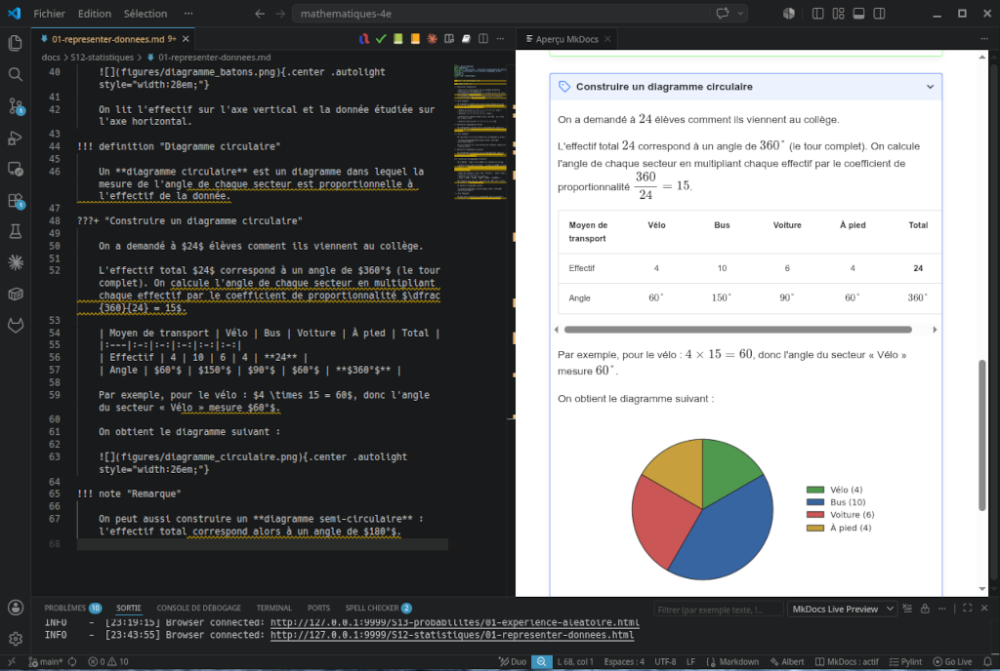

# MkDocs Live Preview

A VS Code extension that previews an **MkDocs** site directly in the editor,
in a panel that follows the active Markdown file.

Unlike a generic Markdown preview, the rendering is produced by the **real
`mkdocs serve` server**: admonitions, tabs, math, and even interactive Python
blocks (pyodide) appear exactly as they do in production. MkDocs livereload
refreshes the preview on every save.



## Installation

The extension is not on the VS Code Marketplace yet, so it is installed from a
`.vsix` package.

1. Get the package: download the latest `.vsix` from the
   [Releases](https://github.com/obook/mkdocs-vsc/releases) page, or build it yourself with `./build.sh` (see
   [Build an installable package](#build-an-installable-package)).
2. Install it, in any of these ways:
   - by drag and drop: drop the `.vsix` file directly onto the Extensions view;
   - from VS Code: open the Extensions view, click the "..." menu, and choose
     *Install from VSIX...*;
   - from the command line:
     `code --install-extension mkdocs-live-preview-<version>.vsix`.
3. Reload VS Code if prompted.

Check that the [requirements](#requirements) below are met. The extension also
verifies them on startup and guides you if `mkdocs` or Python is missing.

## How it works

The extension embeds `mkdocs serve` in an iframe (a webview panel). It does not
touch the editor: you edit the Markdown source as usual, and the panel on the
side shows the faithful rendering.

See [`ARCHITECTURE.md`](ARCHITECTURE.md) for the internal design.

## Requirements

- VS Code 1.90 or later.
- An MkDocs project (a `mkdocs.yml` file at the root of the workspace).
- `mkdocs` installed, preferably in a `.venv` at the project root
  (auto-detected), otherwise available on the `PATH`.

## Run in development

No npm dependencies, no build step: the extension is written in plain
JavaScript.

1. Open this folder in VS Code.
2. Press **F5** (this launches an Extension Development Host).
3. In the new window, open your MkDocs project.
4. Open a `.md` file, then run **MkDocs: Open Live Preview to the Side**
   (the icon in the editor title bar, or `Ctrl+K V`).

The `mkdocs serve` server starts automatically and the preview opens to the side.

## Commands

| Command | Action |
|---|---|
| `MkDocs: Open Live Preview to the Side` | Open the preview beside the editor (starts the server if needed) |
| `MkDocs: Open Live Preview` | Open the preview in the active column |
| `MkDocs: Start Server` | Start `mkdocs serve` |
| `MkDocs: Stop Server` | Stop the server |
| `MkDocs: Restart Server` | Restart the server |

A status bar item shows the server state; clicking it opens the preview.

## Settings

| Setting | Default | Description |
|---|---|---|
| `mkdocsLivePreview.host` | `127.0.0.1` | Host the dev server binds to |
| `mkdocsLivePreview.port` | `9999` | Port the server listens on |
| `mkdocsLivePreview.mkdocsPath` | `""` | Path to `mkdocs` (empty = auto: `.venv` then `PATH`) |
| `mkdocsLivePreview.configFile` | `mkdocs.yml` | MkDocs config file |
| `mkdocsLivePreview.autoSync` | `true` | Follow the active file in the preview |
| `mkdocsLivePreview.serveArgs` | `["--livereload"]` | Extra arguments passed to `mkdocs serve` |

The file-to-page mapping honors `docs_dir` and `use_directory_urls` as read
from `mkdocs.yml`. The extension serves the project of the active file and
restarts the server when you switch projects. If a server is already running on
the configured host and port, it does not start a second one; it warns you,
since that server might belong to another project.

## Snippets

Available in Markdown files: `!!!` (admonition), `???` (collapsible admonition),
`===` (tabs), `math` (math block), `fig` (captioned image).

## Slow rebuilds on Windows

On Windows, the first `mkdocs build` (when opening the preview) and the
incremental rebuilds (on every save) can take many seconds — sometimes more
than a minute on large sites — while the same project rebuilds in two or
three seconds on Linux. Two main causes have been identified:

1. **`on_post_build` hooks that are not incremental.** A hook that walks the
   generated `site/` directory and rewrites files (for example to replace
   third-party CDN URLs with local copies for GDPR compliance) runs on every
   rebuild, even for a one-character change. On NTFS, reading and rewriting
   several hundred small files is significantly slower than on ext4.
2. **Windows Defender real-time scanning.** Each file MkDocs reads or writes
   is scanned by Defender before the I/O completes. Adding the project folder
   (and its `.venv`) to Defender exclusions removes a measurable fraction of
   the overhead.

### What the extension does

Version 0.1.4 mitigates this from the extension side:

- The wait for the server to become ready is raised from 20 s to **120 s** by
  default, so the preview no longer reports *server is not responding* while
  the first build is still running. The value is configurable via
  `mkdocsLivePreview.readyTimeout` (in seconds, minimum 5).
- `PYTHONUNBUFFERED=1` is set for the `mkdocs serve` process, so MkDocs `INFO`
  lines reach the output channel in real time on Windows instead of arriving
  in a single burst at the end of the build.

### What you can do in your MkDocs project

The biggest single win is to **skip heavy `on_post_build` hooks in `mkdocs
serve` mode**, while keeping them active for `mkdocs build` (production).
MkDocs builds into a temporary directory under `tempfile.gettempdir()` in
`serve` mode, and into your project's `site/` in `build` mode. Detecting
this in your hook keeps it free in development:

```python
import tempfile
from pathlib import Path

def on_post_build(config, **kwargs):
    site_dir = Path(config["site_dir"]).resolve()
    tmp_root = Path(tempfile.gettempdir()).resolve()
    if tmp_root in site_dir.parents or site_dir == tmp_root:
        return  # Skip in `mkdocs serve` mode
    # ... heavy work for production builds only
```

This pattern preserves the hook's effect on production builds (the ones that
feed your real deployment) and removes seconds — sometimes tens of seconds —
from every save during editing. In one real project, this single change took
the per-save rebuild from "insufferably long" to nearly instantaneous.

## Build an installable package

```bash
./build.sh
```

This produces `dist/mkdocs-live-preview-<version>.vsix`, which you can install
with `code --install-extension <file>.vsix` or through *Extensions: Install
from VSIX...*.

## Security, privacy and accessibility

- [`SECURITY.md`](SECURITY.md) - security assessment (ANSSI secure development guide).
- [`GDPR.md`](GDPR.md) - privacy assessment (GDPR): no data collected, no telemetry.
- [`ACCESSIBILITY.md`](ACCESSIBILITY.md) - accessibility statement (RGAA 4.x).

## Tools and licenses

This extension has **no runtime npm dependencies**; it uses only the VS Code API
and Node.js built-in modules. It builds on:

- [MkDocs](https://www.mkdocs.org/) - the documentation server it drives;
  BSD-2-Clause ([repository](https://github.com/mkdocs/mkdocs)).
- [VS Code extension API](https://code.visualstudio.com/api) - the host
  platform (Microsoft).
- [Node.js](https://nodejs.org/) - built-in modules only, provided by the
  VS Code runtime.
- [@vscode/vsce](https://github.com/microsoft/vscode-vsce) - development only,
  used by `build.sh` to package the `.vsix`; MIT.

The editor-title icon is derived from the MkDocs project favicon; "MkDocs" and
its logo belong to the MkDocs project.

## License

This extension is released under the MIT License. See [`LICENSE`](LICENSE).
